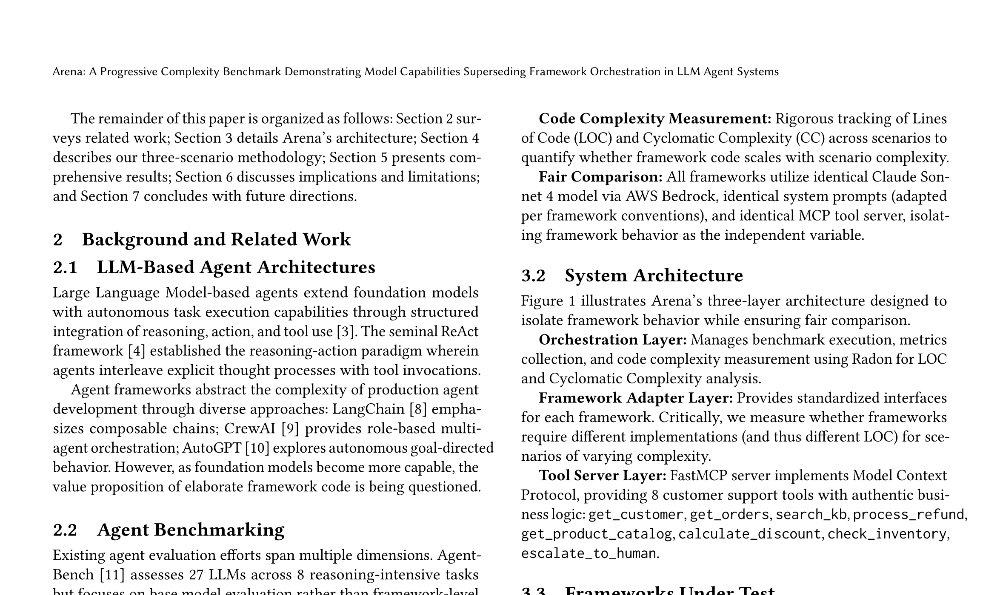

# Arena: Benchmarking AI Agent Frameworks Under Fixed-Model Conditions

**ACM CAIS 2026 — Demo Track Submission**

Roberto Milev, Uday Kanagala — Navan

---

## Overview

Existing agent benchmarks evaluate models, not the frameworks that orchestrate them, making it impossible to isolate how much of an agent's performance comes from the model versus the framework's orchestration code. **Arena** is an open-source benchmarking tool that evaluates agent frameworks under fixed-model conditions.

Arena fixes six frameworks — Claude Agent SDK, LangChain, LangGraph, AWS Strands, CrewAI, and Google ADK — to Claude Sonnet 4.5 on AWS Bedrock, connects them to the same MCP tool server, and scores them with a deterministic evaluator across three progressively complex customer-support scenarios. As task complexity increases, traditional frameworks require entirely new multi-agent implementations (190–267 lines of new code) while the Claude Agent SDK adapter remains unchanged — only the prompt changes. Despite the additional orchestration code, the traditional frameworks achieve no correctness advantage.

### Architecture



### How It Works

1. **Framework adapters** — Each of the six frameworks implements a common `FrameworkAdapter` interface that bridges MCP tools into the framework's native format (Pydantic models for CrewAI, `StructuredTool` wrappers for LangChain, `inspect.Signature` bindings for AWS Strands, etc.).

2. **Scenario execution** — The benchmark orchestrator runs each framework through three scenarios of increasing complexity: simple refund (S1, 3 tool calls), multi-issue resolution (S2, 8 tool calls), and multi-agent product investigation (S3, 12 tool calls). Each scenario runs K=3 times per framework (54 total runs).

3. **Deterministic evaluation** — Each run is scored by a rule-based evaluator against scenario-specific criteria (e.g., "did the agent process the refund?", "did it acknowledge all three issues?", "did it stay within the customer's budget?").

4. **Metrics collection** — Six metrics are captured per run: lines of code + cyclomatic complexity (via Radon), step efficiency, wall-clock latency, correctness, consistency (pass^3 adapted from tau-bench), and cost per task.

## Demo Artifacts

The demo runs three customer-support scenarios against all six frameworks in real time, displaying per-run metrics as they complete.

| Artifact | Description |
|----------|-------------|
| [Benchmark source](arena/) | Framework adapters, MCP tool server, evaluator, and runner |
| [Benchmark results](arena/results/) | Raw JSON results and summary table from 54 benchmark runs |
| [Figures](figures/) | Publication-quality figures (architecture, LoC growth, correctness, Pareto, consistency) |

## Resources

| Resource | Link |
|----------|------|
| Conference | [ACM CAIS 2026](https://www.caisconf.org/) |

## Technology Stack

- **Evaluated Frameworks:** Claude Agent SDK, LangChain, LangGraph, AWS Strands, CrewAI, Google ADK
- **Fixed LLM:** Claude Sonnet 4.5 on AWS Bedrock
- **Tool Protocol:** Model Context Protocol (MCP) via FastMCP stdio server
- **Code Metrics:** Radon (lines of code + cyclomatic complexity)
- **Consistency Metric:** pass^3 adapted from tau-bench
- **Domain:** Simulated customer support (8 deterministic tools)

## Repository Structure

```
├── README.md
├── figures/                                 # Architecture diagram and publication figures
├── arena/
│   ├── frameworks/                          # 6 framework adapters + 5 multi-agent adapters
│   ├── scenarios/                           # S1, S2, S3 scenario definitions + prompts
│   ├── results/                             # Benchmark output (JSON + Markdown)
│   ├── mcp_server_v2.py                     # FastMCP tool server (8 domain tools)
│   ├── evaluator.py                         # Deterministic correctness scoring
│   └── runner_simple.py                     # CLI benchmark runner
├── pyproject.toml
└── video/                                   # Demo video (raw binary for archival)
```
